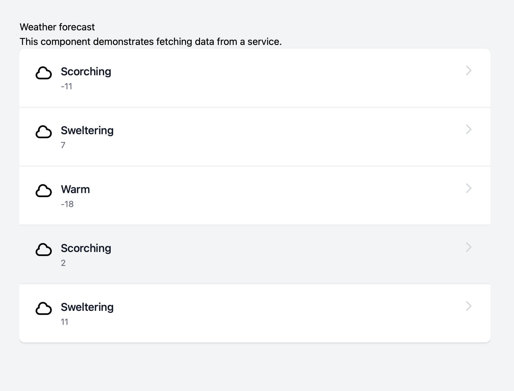

# TailBlazor.Table

Blazor List a basic yet customizable list component for Tailwindcss

Without passing it anything you'll get very basic styles, however giving it it's base classes and you can really make a customizable list component that Tailwind is capable of.




## Getting Setup

You can install the package via the NuGet package manager just search for TailBlazor.List. You can also install via powershell using the following command.

`Install-Package TailBlazor.List`

Or via the dotnet CLI.

`dotnet add package TailBlazor.List`

### 1. Add Imports

Add line to your \_Imports.razor

```
@using TailBlazor.List
```

### 2. Create List Component

Inside your page create your list component with the basic format below. Add your class to `TItem` and then your list of items in the `Items` parameter to give you full context for each item inside the template using `@context`. If you'd like to name your context for better readability use the `Context` parameter

```
<TailBlazorListTemplate Context="Forecast" TItem=Item Items=ItemsList class="divide-gray-200">
    <div class="flex p-6 hover:bg-gray-100">
        <div class=" flex flex-1">
            <TailBlazorHeroIcon Icon=HeroIcon.Cloud Width=32 Height=32 />
            <div class="ml-3">
                <p class="text-lg font-medium text-gray-900">@Forecast.Summary</p>
                <p class="text-sm text-gray-500">@Forecast.TemperatureC</p>
            </div>
        </div>
        <div>
            <TailBlazorHeroIcon Icon=HeroIcon.ChevronRight Stroke="text-gray-300" />
        </div>
    </div>
</TailBlazorListTemplate>
```

### 3. Adding more styles

by default we set a small shadow, and rounded corners on medium displays, however you can override it by simply setting `class` or `Class`

```
<TailBlazorListTemplate class="divide-blue-500">
```